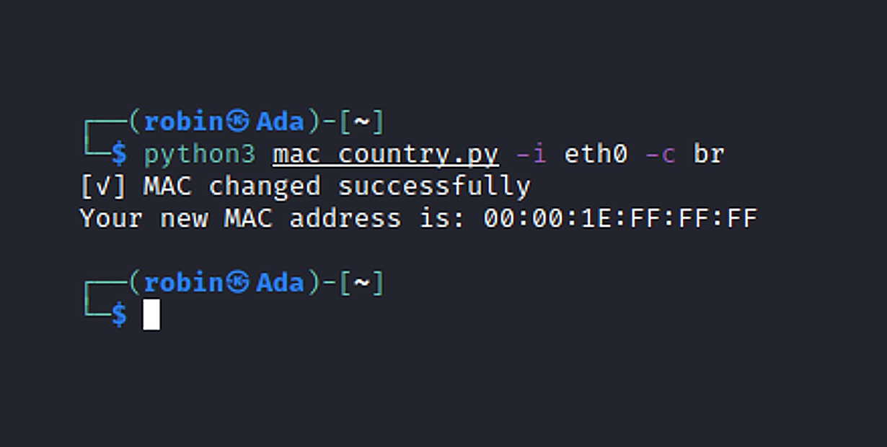

___
# mac_country.py

**mac_country.py** allows you to change your MAC address to a MAC address from any other country.
___
# Installation

```bash
git clone https://github.com/d4rp1/mac_country
```

```bash
cd mac_country
```
```bash
python3 mac_country.py -h
```
___
<p align="center">

</p>

___
